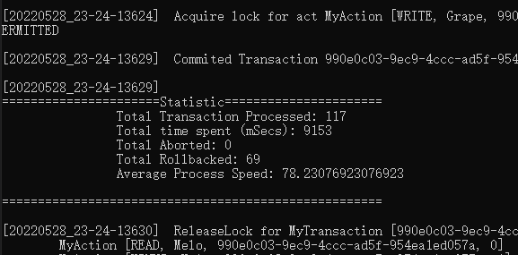
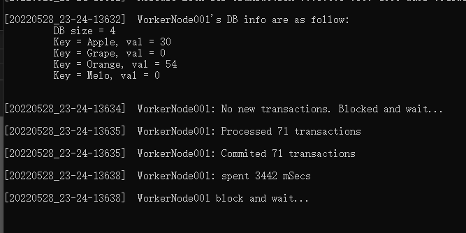

# Distributed Synchronization Simulator

[](https://github.com/Dai0526/CFSTeamProject/actions/workflows/Java17_Ubuntu_.yml)
[](https://github.com/Dai0526/CFSTeamProject/actions/workflows/Java17_MacOS_x64.yml)
[](https://github.com/Dai0526/CFSTeamProject/actions/workflows/Java17_Win_x64_.yml)

## Introduction
This project is the implementation of distributed synchronization methods for the research project at Santa Clara University COEN 283 Operating Systems.


## **Modules**
```
/DistributedSyncSimulator/
│
├─bin
│  └─distributedsyncsimulator
│      ├─ifc
│      ├─leadnode
│      ├─shared
│      ├─utilities
│      └─worknode
├─Interface
│  └─src
│      ├─main/java/distributedsyncsimulator/interface
│                                             |-LeaderIFC.java
│                                             |-WorkerIFC.java      
├─LaunchScript
│  │ -StartLead2PL.bat
│  │ -StartLeadTS.bat
│  │ -StartRMI.bat
│  │ -StartWorkeNodes.bat
│  │ -StartWorkeNodesNoConflic.bat
│  │
│  └─log
│
├─LeadNode
│  └─src
│      ├─main/java/distributedsyncsimulator/leadnode
│                                            |-LeadNode.java
│                                            |-SanpshotIsolationManager.java
│                                            |-SyncManagerBase.java
│                                            |-TimeStampOrderingManager.java
│                                            |-TwoPhaseLockManager.java
├─SampleLog
│  ├─2 Phase Lock
│  │      |-LeadNode_20220528_22-20-0575.log
│  │      |-WorkerNode001_20220528_22-20-19269.log
│  │      |-WorkerNode002_20220528_22-20-19269.log
│  │
│  └─Timestamp Ordering
│          |-LeadNode_20220528_22-21-25462.log
│          |-WorkerNode001_20220528_22-21-30256.log
│          |-WorkerNode002_20220528_22-21-30255.log
│
├─Shared
│  └─src
│      ├─main/java/distributedsyncsimulator/shared
│                                           |-MyAction.java  
│                                           |-MyConfiguration.java  
│                                           |-MyDatabase.java
│                                           |-MyLock.java
│                                           |-MyLog.java
│                                           |-MyTransaction.java
│ 
├─Transactions
│      |-test.txt
│      |-trans1.txt
│      |-trans2.txt
│
├─Utilities
│  └─src
│      ├─main/java/distributedsyncsimulator/utilities
│                                             |-Constants.java
│                                             |-MyUtils.java
└─WorkNode
    └─src
        ├─main/java/distributedsyncsimulator/worknode
                                              |-WorkNode.java
        
```


## **Design**


### **Distributed Environment setup**
Java Remote Method Invocation (**RMI**)
  - Server
  - Client

### **Virtualized In-Memory Database**
Though the distributed environment is designed based on the distributed database system, the focus is on the Synchronization Algorithm simulation. Thus, it is not necessary to implement a middleware to communicate with real database. Instead, we can abstact the concpet of database by simulated it with a key-value in memory DB.

* Designed as a singleton, such that one worker node can only monitor/operate one databse
* Use a hashmap to simulate the key-value db
  * key - String
  * value - integer
* It support 4 operations
  1. read
  2. write
  3. add
  4. minus

****

## **Input Data - Transactions**

A transaction can contains multiple operations, and each action is seperated by delimeter `-`. The allowed actions typs are as follow:  
1. read - r
2. write - w
3. plus - p
4. minus - m

The pattern for **read** and **write** operations are `<r/w>-<key>`. For example, `r-Apple` means read Apple's value.  

The pattern for **plus** and **minus** operations are: `<p/m>-<key>-<value>`. For example, `p-Apple-9` means add 9 to Apple.

A typical transaction example is as follow:
```
r-Apple,p-Apple-9,w-Apple,r-Orange,p-Orange-9,w-Orange
```

There are two sets of input Transactions:  
1. **trans<#>.txt**
    * the number means the worker number. e.g. trans1.txt will be consumed by worker1
    * It is generate by script.
    * Currentlt, trans1.txt and trans2.txt are designed by purpose to avoid deadlock when run together.
2. **test.txt**
    * this short transaction lists are design for sanity check
    * It is used to check if the program is running as designed.

## **Output data - Log**

[MyLog.java](./DistributedSyncSimulator/Shared/src/main/java/distributedsyncsimulator/shared/MyLog.java)
* A singleton
* use synchornous queue to save logs
* A thread object called LogHandler to fetch messages from sync_queue continously
  * print to screen
  * write to log file

The log file will be saved in `./log`, that is created in the running directory. For example, if you execute running script in _./DistributedSyncSimulator/LaunchScript_, then the log directory will be created at _./DistributedSyncSimulator/LaunchScript/log_.  

Each node will generated its own logs. For example, if the test runs with 1 `LeadNode` and 2 `WorkerNode`, the log files will be created like something similiar to the following:  
  * LeadNode Log  
      * Pattern: _LeadNode_timestamp.log_
      * Example: _LeadNode_20220527_00-52-13265.log_
  * WorkerNode Log
      * Pattern: _WorkerNodeNNN_timestamp.log_
      * Example: 
        * _WorkerNode001_20220527_00-52-32456.log_ 
        * _WorkerNode002_20220527_00-52-32457.log_


## **Usage**
### I. **Prerequsite**
Install **gradle** and **Java**, and set the environment proper. You can verify the installation by enter the following command in cmd. It should be able to show the verison infomations for both.
  ```bash
  > gradle --version

  ------------------------------------------------------------
  Gradle 7.4.2
  ------------------------------------------------------------

  Build time:   2022-03-31 15:25:29 UTC
  Revision:     540473b8118064efcc264694cbcaa4b677f61041

  Kotlin:       1.5.31
  Groovy:       3.0.9
  Ant:          Apache Ant(TM) version 1.10.11 compiled on July 10 2021
  JVM:          17.0.2 (Eclipse Adoptium 17.0.2+8)
  OS:           Windows 10 10.0 amd64

  > java --version
  openjdk 17.0.2 2022-01-18
  OpenJDK Runtime Environment Temurin-17.0.2+8 (build 17.0.2+8)
  OpenJDK 64-Bit Server VM Temurin-17.0.2+8 (build 17.0.2+8, mixed mode, sharing)

  ```

### **II. Compile**
1. Launch CMD and naviagte to _SyncSimulator\DistributedSyncSimulator_
    ```bash
    > cd SyncSimulator\DistributedSyncSimulator
    ```
2. Build project using gradle 
    ```bash
    > gradle build
    ```

3. The compiled class file is located at `bin` file at _SyncSimulator\DistributedSyncSimulator\bin\_

### **III. Run**
0. Launch CMD and naviagte to _./DistributedSyncSimulator/_
1. Launch LeadNode
    * Manually enter command in cmd with argument to choose Sync Methods:
      * 0 -> 2 Phase Lock
      * 1 -> Time Ordering Algorithm
      ```bash
      # using 2PL
      > java -classpath bin -Djava.rmi.server.hostname=localhost distributedsyncsimulator.leadnode.LeadNode 0

      # or using Time Ordering 
      > java -classpath bin -Djava.rmi.server.hostname=localhost distributedsyncsimulator.leadnode.LeadNode 1

      ```
    * In windows, you can run script [StartLeadNode{methodName}.bat](./DistributedSyncSimulator/LaunchScript/StartLead2PL.bat)
      ```bash
      # using 2PL
      > StartLead2PL.bat

      # using Time Ordering 
      > StartLeadTS.bat
      ```

2. Launch Worker Node
    * Launch a single worker node by using command
      ```bash
      # launch worker node name WorkerNode001, and comsumes transaction test.txt
      > start cmd.exe /k java -classpath bin distributedsyncsimulator.worknode.WorkNode 001 Transactions\test.txt
      ```
    * In windows, you can run script [StartWorkeNodes.bat](./DistributedSyncSimulator/LaunchScript/StartWorkeNodes.bat) to launch 2 WorkerNodes:
      * WorkerNode001
        * consumes test.txt 
      * WorkerNode001
        * consumes test.txt
      * Since they use the same Transactions, it will cause `deadlock`.
        ```bash
        > StartLeadNodes.bat
        ```
    * In windows, you can run script [StartWorkeNodesNoConflic.bat](./DistributedSyncSimulator/LaunchScript/StartWorkeNodesNoConflic.bat) to launch 2 WorkerNodes:
      * WorkerNode001
        * consumes trans1.txt 
      * WorkerNode001
        * consumes trans2.txt
      * Since they use the two different designed Transactions, no dead lock will happen.
        ```bash
        > StartWorkeNodesNoConflict.bat
        ```
* RMI Service  
  * If the error messages show that the RMI service is not running, you can start the RMI service manually with correct bin directory path by
    ```
    > start rmiregistry -J-Djava.rmi.server.codebase=file:<bin_file_path>
    ```  
  * In Windows, You can also use script [StartRMI.bat](./DistributedSyncSimulator/LaunchScript/StartRMI.bat) to launch RMI services
    ```
    > StartRMI.bat
    ```

## Statistic
The log file is generated with a certain pattern when an event is occur and labeled with key words and timestamps. A log analyze tool could be developed to read log and parse the key words to do log analysis, profile benchmark, etc.  

As of 05/28/2022, there is no bandwidth for me to implement this tool. I used some in-program variables to do simple statistic collection. The simple benchmark will be showned as follow:

* Lead Node  
  
* Work Node  
  

## Tools
* Programming Language:
  * Java 17
  * Python 3
  * Batch
* 3rd Party Library: N/A
* Build Tool
  * Gradle 7.4
* OS tested
  * build envrionment
    * win10
    * ubuntu
    * macos
  * run envrionment
    * Windows 10 x64

